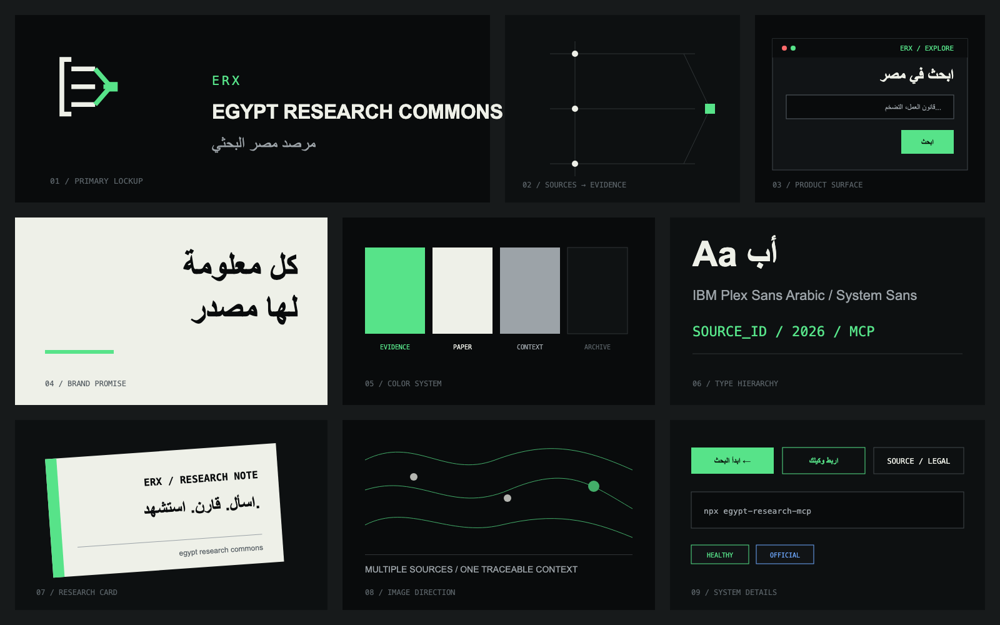

# ERX Brand System

## الهوية

- الاسم المختصر: **ERX**
- الاسم الإنجليزي: **Egypt Research Commons**
- الاسم العربي: **مرصد مصر البحثي**
- الوعد: **كل معلومة لها مصدر**
- الوعد الإنجليزي: **Every claim needs a source**
- الوصف المختصر: طبقة بحث مفتوحة وموثقة المصدر للشأن المصري، للباحثين والوكلاء الذكية.

لا يُقدَّم ERX كوسيلة إعلام، ولا كجهة تحقق، ولا كبديل عن المصدر الأصلي. هو بنية بحث تساعد المستخدم على الوصول إلى الدليل ومقارنة سياقه.

## فكرة العلامة

العلامة تجمع بين ثلاثة خطوط تمثل تعدد المصادر، وعقدة خضراء تمثل نقطة الدليل التي تلتقي عندها النتائج. القوس المفتوح يرمز إلى الأرشيف القابل للفحص، لا إلى صندوق مغلق.

## الجمهور

1. الباحثون ومراكز الدراسات والسياسات العامة.
2. الصحفيون الاستقصائيون ومدققو المعلومات.
3. الحقوقيون والباحثون القانونيون.
4. فرق البيانات وArabic NLP ومطورو وكلاء AI.
5. الجامعات والمكتبات والأرشيفات المفتوحة.

## نبرة الصوت

- دقيقة، هادئة، ومحددة.
- تقول «المصدر يذكر» بدل «الحقيقة هي».
- تعرض الحدود والفجوات بجوار النتائج.
- تستخدم العربية الفصحى المباشرة، وإنجليزية بحثية بسيطة.
- لا تستخدم مبالغة مثل «ثوري»، «الأفضل»، أو «ذكاء لا يخطئ».

## النظام البصري

| الدور | اللون | الاستخدام |
|---|---|---|
| Evidence Green | `#57E389` | الروابط الأساسية، حالة النجاح، نقطة الدليل |
| Archive Black | `#090B0C` | الخلفية الرئيسية |
| Paper White | `#EEF0E8` | العناوين والنص عالي التباين |
| Context Gray | `#9CA3A8` | البيانات الثانوية والحدود |
| Alert Red | `#FF6B6B` | الفشل فقط |
| Link Blue | `#6EA8FE` | الروابط التقنية الخارجية |

الخط الأساسي: `Readex Pro` بالأوزان 400–700، وهو مضمن محليًا في المنتج للعربية
واللاتينية. البيانات والأوامر ومعرّفات الأدوات: monospace.

## قواعد الواجهة

- خلفية Archive Black مع شبكة دليل خضراء خافتة؛ لا تستخدم خلفية بيضاء للصفحة الرئيسية.
- يظهر الوعد «كل معلومة لها مصدر» في الجزء الأول قبل أي قائمة ميزات.
- يكتب مسار المنتج دائمًا بهذا الترتيب: السؤال ← المصادر ← الأدلة ← الاستشهاد.
- الصور وثائقية هادئة: أوراق، خرائط، أرشيف، ومكاتب بحث. لا تستخدم صور روبوتات أو أدمغة رقمية.
- الحركة تشرح انتقال السؤال إلى مصدر واستشهاد، ولا تستخدم كزينة منفصلة عن المنتج.
- الزوايا حادة، الخطوط 1px، واللون الأخضر يشير إلى الدليل أو الحالة السليمة فقط.

## استخدام الشعار

- اترك مساحة فارغة حول العلامة تساوي ربع عرضها على الأقل.
- أصغر حجم رقمي للعلامة 24px، وللقفل الكامل 120px.
- استخدم النسخة الخضراء/البيضاء على الأسود أو السوداء على الأبيض فقط.
- لا تضف gradient أو glow أو زوايا دائرية أو ظلًا.
- لا تفصل ERX عن الاسم الكامل في أول ظهور داخل صفحة أو عرض تقديمي.

## الرسائل الأساسية

- «اسأل. قارن. استشهد.»
- «ابحث في مصر، لا في الضوضاء.»
- «مصادر متعددة. سياق واحد قابل للمراجعة.»
- «من السؤال إلى الدليل، دون فقدان المصدر.»

## التسمية الرقمية

- GitHub: `ahmedvnabil/erx`
- npm: `egypt-research-mcp`
- MCP Registry: `io.github.ahmedvnabil/egypt-research`
- النطاق: `erx-mcp.zad.tools`
- نقطة MCP: `https://erx-mcp.zad.tools/mcp`

لا تُستخدم نقطة الإنتاج المقترحة في `server.json` قبل أن تصبح متاحة علنًا وتنجح اختبارات MCP عليها.
