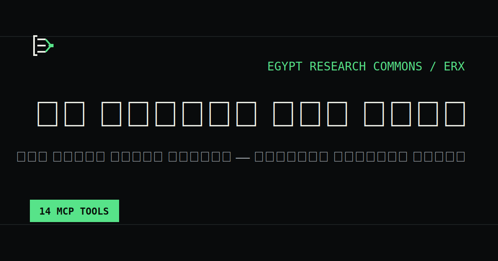

# ERX — Egypt Research Commons



**كل معلومة لها مصدر.** بحث عربي موثّق للشأن المصري للباحثين والصحفيين
ووكلاء AI.

[التشغيل](#التشغيل) · [أدوات MCP](#أدوات-mcp) · [النشر](#النشر) ·
[الهوية](BRAND.md) · [خطة التسويق](docs/go-to-market.md)

**Production:** [erx-mcp.zad.tools](https://erx-mcp.zad.tools) ·
MCP: `https://erx-mcp.zad.tools/mcp`

## الإمكانات الحالية

- كتالوج من 33 مصدرًا رسميًا وقانونيًا وأكاديميًا وإحصائيًا وإخباريًا وحقوقيًا.
- 19 مصدرًا بقنوات جمع متحققة: 17 RSS و2 Sitemap، دون الاعتماد على Google News.
- تدقيق حي للمصادر الـ33 يختبر الاستجابة وصحة XML وعدد العناصر، ويميز الحجب و429 والتحويلات غير المتوافقة.
- استخراج HTML وPDF، مع طبقة النص أولًا ثم OCR عربي محدود الموارد عند الحاجة.
- احترام `robots.txt` وسياسة تأخير مستقلة لكل مصدر وحدود للحجم والصفحات.
- أرشفة إصدارات الوثائق عند تغير محتواها.
- تجميع التغطيات المتشابهة في قصص مع إظهار عدد الوثائق وتنوع المصادر.
- سجل لكل عملية جمع، بما فيها الفشل والمدة وعدد المواد.
- بحث عربي هجين يجمع SQLite FTS5 وتمثيلًا دلاليًا محليًا قابلًا للتفسير.
- دعم اختياري لـ Gemini Embeddings عبر `GEMINI_API_KEY`.
- استخراج كيانات وأحداث وادعاءات منسوبة وربطها بالأدلة الأصلية.
- تصنيف موضوعي عربي قابل للمراجعة.
- روابط واستشهادات أصلية مع تاريخ النشر والأرشفة.
- تصدير CSV وJSONL وBibTeX وRIS.
- واجهة عربية RTL تعمل دون حساب مستخدم.
- Streamable HTTP للاستخدام البعيد وstdio للاستخدام المحلي.
- REST API مستقرة تحت `/api/v1` مع وصف OpenAPI.
- readiness ومقاييس Prometheus وتحديد معدل ورؤوس أمان.
- نسخ واستعادة SQLite متسقان مع فحص سلامة ونسخة أمان قبل الاستعادة.

## أدوات MCP

| الأداة | الاستخدام |
|---|---|
| `search_egypt` | البحث بالنص ونوع المصدر والفترة الزمنية |
| `get_document` | استرجاع وثيقة كاملة مع الاستشهاد |
| `build_timeline` | بناء خط زمني لموضوع أو قضية |
| `compare_sources` | مقارنة التغطية حسب نوع المصدر |
| `get_source_profile` | معلومات المصدر وصحة الجمع |
| `list_sources` | عرض كتالوج المصادر |
| `get_daily_brief` | مواد يوم محدد وتنوع مصادرها |
| `list_stories` | القصص المتقاربة وتنوع ناشريها |
| `export_references` | تصدير نتائج قابلة للإدخال في Zotero ومديري المراجع |
| `hybrid_search` | بحث نصي ودلالي مع سبب ترتيب كل نتيجة |
| `find_entities` | الكيانات المستخرجة وعدد الوثائق والظهور |
| `list_events` | الأحداث المؤرخة ووثائقها الأصلية |
| `trace_claim` | تتبع الادعاء إلى كل دليل ومصدر أورده |
| `save_research_query` | حفظ استعلام متابعة محلي؛ معطلة في نقطة MCP العامة |

يوفر السيرفر أيضًا موارد `egypt://sources` و`egypt://taxonomy` و`egypt://methodology`، بالإضافة إلى prompts للبحث المنظم والتحقق من الادعاءات.

## التشغيل

يتطلب Node.js 24 أو أحدث وnpm.

```bash
npm ci
npm run build
node dist/cli.js init
node dist/cli.js seed
node dist/cli.js ingest
node dist/cli.js ingest --source eipr --full-text
node dist/cli.js ingest --channel sitemap --max-urls 200
node dist/cli.js audit-sources --concurrency 10
node dist/cli.js index --provider local
node dist/cli.js status
```

تشغيل واجهة الباحث وMCP معًا:

```bash
node dist/cli.js serve --transport http --host 127.0.0.1 --port 8000
```

عنوان الاتصال:

```text
http://127.0.0.1:8000/mcp
```

Landing Page: `http://127.0.0.1:8000/`، واجهة الباحث: `/explore`،
التوثيق: `/docs`، خريطة المعرفة: `/knowledge`، الـAPI:
`/api/v1/openapi.json`، وحالة الجاهزية: `/readyz`.

تشغيله محليًا عبر stdio:

```bash
node dist/cli.js serve --transport stdio
```

يمكن تغيير قاعدة البيانات عبر `--database` أو متغير البيئة `EGYPT_RESEARCH_DB`.

النسخ والاستعادة:

```bash
node dist/cli.js backup --output backups/snapshot.db
node dist/cli.js verify-backup --input backups/snapshot.db
node dist/cli.js restore --input backups/snapshot.db --yes
```

## Docker

```bash
docker compose build
docker compose run --rm egypt-research node dist/cli.js seed
docker compose run --rm egypt-research node dist/cli.js ingest
docker compose up -d
```

تُحفظ قاعدة البيانات في volume مستقل. أضف مهمة مجدولة خارج الحاوية لتشغيل
`ingest` دوريًا؛ واستخدم `--full-text` فقط للمصادر التي تسمح بنيتها وسياساتها بذلك.
راجع [دليل التشغيل](docs/operations.md) للنشر والجدولة والاستعادة.

## النشر

المستودع مجهز بثلاث قنوات توزيع متزامنة عند إنشاء tag:

1. حزمة عامة على npm.
2. تسجيل رسمي في MCP Registry باسم `io.github.ahmedvnabil/egypt-research`.
3. صورة متعددة المعماريات على GitHub Container Registry.

يُنشر الموقع وStreamable HTTP على `erx-mcp.zad.tools`، بينما ينشر إنشاء tag
الحزمة العامة وبيانات MCP Registry وGitHub Release تلقائيًا.

```bash
npm run release:check
git tag v0.6.0
git push origin v0.6.0
```

راجع [قائمة الإطلاق](docs/launch-checklist.md) و[حزمة محتوى الإطلاق](docs/launch-content.md).

## إضافة المصدر إلى عميل MCP

مثال لعميل يدعم Streamable HTTP:

```json
{
  "mcpServers": {
    "egypt-research": {
      "url": "https://erx-mcp.zad.tools/mcp"
    }
  }
}
```

## الاختبارات

```bash
npm run check
npm run test:coverage
npm run build
```

## المنهجية والحدود

- المنصة لا تمنح المصادر درجة حقيقة آلية.
- تكرار ادعاء في عدة مصادر لا يعني أنه تحقق بصورة مستقلة.
- بعض المصادر موجودة في الكتالوج دون جمع آلي حتى تتوفر لها قناة مباشرة موثقة.
- المحتوى المتاح يعتمد على ما تنشره قناة المصدر؛ يظل الرابط الأصلي هو المرجع النهائي.
- تجميع القصص تشابه نصي مساعد وليس حكمًا تحريريًا أو تحققًا آليًا.
- الكود MIT، لكن حقوق المواد المفهرسة تظل لأصحاب المصادر الأصلية.
- الوضع الافتراضي يربط السيرفر بـ`127.0.0.1`. يجب إضافة HTTPS وبوابة موثوقة وتحديد معدل موزع عند تشغيل عدة نسخ عامة.
