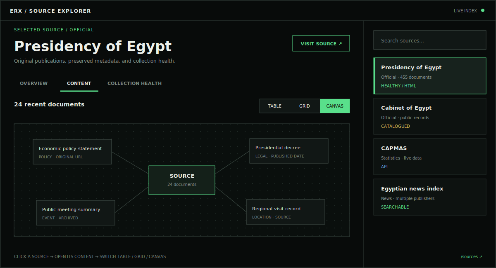

<p align="center">
  
</p>

<h1 align="center">ERX — Egypt Research Commons</h1>

<p align="center"><strong>تابع الشأن المصري. ارجع إلى المصدر. · Follow Egyptian public affairs. Return to the source.</strong></p>

<p align="center">
  محرك بحث وأرشيف للأخبار المصرية والوثائق والبيانات العامة، للباحثين والصحفيين.<br>
  Search Egyptian news, public records and data with every result tied to its source.
</p>

<p align="center">
  <a href="https://erx-mcp.zad.tools">الموقع</a> ·
  <a href="https://erx-mcp.zad.tools/explore">البحث</a> ·
  <a href="https://erx-mcp.zad.tools/docs">التوثيق</a> ·
  <a href="BRAND.md">الهوية</a> ·
  <a href="docs/architecture.md">المعمارية</a>
</p>

<p align="center">
  
</p>

<p align="center">
  
</p>

## ابحث في مصر، لا في الضوضاء

ERX موجه للباحث والصحفي الذي يبدأ بسؤال عن الشأن المصري: قرار حكومي، مؤشر
اقتصادي، تشريع، قضية حقوقية، خدمة عامة، أو طريقة تناول المصادر لخبر واحد.
يجمع المواد الإخبارية والوثائق الرسمية والقانونية والأكاديمية والبيانات العامة،
ثم يربط كل نتيجة بالرابط الأصلي وتاريخ النشر وسياق الظهور وسبب الترتيب.

ERX ليس وسيلة إعلام ولا يقرر صحة الادعاء نيابة عن الباحث. هو مساحة بحث قابلة
للمراجعة تساعدك على الانتقال من **السؤال → المصادر → الأدلة → الاستشهاد**.

## ماذا يمكنك أن تبحث؟

| الملف | أمثلة عملية |
|---|---|
| السياسة والاقتصاد | تتبع قرار حكومي، مقارنة التغطية، وربطه بالموازنة أو المؤشرات العامة |
| القانون والحقوق | الوصول إلى التشريع أو الحكم أو البيان الأصلي ومتابعة تطور القضية |
| المجتمع والخدمات العامة | بحث الصحة والتعليم والعمل والسكان عبر الأخبار والبيانات |
| الإعلام والخطاب العام | مقارنة العناوين والمواقف وتنوع الناشرين عبر فترة زمنية |

ابدأ من [واجهة البحث](https://erx-mcp.zad.tools/explore) دون حساب. ويمكن للمطورين
ووكلاء الذكاء الاصطناعي استخدام طبقة MCP وREST نفسها بعد ذلك.

| ما الذي يقدمه ERX؟ | كيف يبقى قابلًا للمراجعة؟ |
|---|---|
| بحث عربي نصي ودلالي | سبب ترتيب واضح لكل نتيجة |
| مقارنة التغطيات والادعاءات | رابط الوثيقة والناشر والتاريخ |
| خط زمني وكيانات وأحداث | فصل تاريخ الحدث عن النشر والأرشفة |
| بيانات عامة حية | الترخيص ووقت الجلب والرابط الأصلي |
| تصدير RIS وBibTeX وCSV وJSONL | نقل المراجع دون فقدان المصدر |

## ابدأ خلال دقيقة

نقطة MCP العامة:

```text
https://erx-mcp.zad.tools/mcp
```

مثال لعميل يدعم Streamable HTTP:

```json
{
  "mcpServers": {
    "egypt-research": {
      "url": "https://erx-mcp.zad.tools/mcp"
    }
  }
}
```

أو شغّله محليًا عبر stdio:

```bash
npx -y egypt-research-mcp serve --transport stdio
```

## السطوح المتاحة

| السطح | المسار | الاستخدام |
|---|---|---|
| الصفحة الرئيسية | `/` | تعريف المنتج وحالة الأرشيف |
| واجهة الباحث | `/explore` | بحث عربي دون حساب |
| خريطة المعرفة | `/knowledge` | كيانات وأحداث وادعاءات |
| توثيق API | `/docs` | المسارات وأمثلة الاستخدام |
| MCP | `/mcp` | Streamable HTTP للوكلاء |
| REST API | `/api/v1` | تكاملات مستقرة وقابلة للقراءة |
| الجاهزية | `/readyz` | فحص سلامة قاعدة البيانات |
| المقاييس | `/metrics` | مقاييس Prometheus |

## أدوات MCP

### البحث والتتبع

| الأداة | الوظيفة |
|---|---|
| `search_egypt` | بحث حسب النص ونوع المصدر والفترة |
| `hybrid_search` | بحث نصي ودلالي مع تفسير الترتيب |
| `get_document` | وثيقة كاملة مع بيانات الاستشهاد |
| `research_dossier` | نتائج وخط زمني وكيانات وادعاءات في طلب واحد |
| `trace_claim` | تتبع الادعاء إلى الأدلة التي أوردته |
| `compare_claims` | تجميع الادعاءات المتشابهة ومقارنة المواقف |

### المقارنة والتنظيم

| الأداة | الوظيفة |
|---|---|
| `compare_sources` | مقارنة التغطية حسب نوع المصدر |
| `build_timeline` | بناء خط زمني موثق |
| `list_stories` | قصص متقاربة مع تنوع الناشرين |
| `find_entities` | الكيانات ومواضع ظهورها |
| `list_events` | الأحداث المؤرخة ووثائقها |
| `get_daily_brief` | مواد يوم محدد وتنوع مصادرها |
| `list_sources` | عرض كتالوج المصادر التشغيلية |
| `get_source_profile` | بيانات المصدر وصحة الجمع |

### البيانات والتصدير

| الأداة | الوظيفة |
|---|---|
| `list_live_datasets` | كتالوج مجموعات البيانات العامة |
| `get_live_data` | جلب مؤشر أو سجل حي مع بيانات المصدر |
| `compare_live_data` | مقارنة سلاسل مع تنبيه اختلاف المنهجيات |
| `live_source_health` | فحص صحة موفري البيانات الحية |
| `export_references` | تصدير RIS وBibTeX وCSV وJSONL |
| `get_coverage` | تغطية الأرشيف وصحة المصادر |
| `save_research_query` | حفظ استعلام متابعة محليًا؛ معطلة على نقطة MCP العامة |

توجد أيضًا موارد `egypt://sources` و`egypt://taxonomy` و`egypt://methodology`،
وprompts للبحث المنظم والتحقق من الادعاءات. راجع [`src/mcp.ts`](src/mcp.ts)
للتعريف التنفيذي الكامل.

## كيف يعمل

<p align="center">
  
</p>

- يجمع ERX من 24 مصدرًا تشغيليًا رسميًا وقانونيًا وأكاديميًا وإحصائيًا
  وإخباريًا وحقوقيًا. المصدر المغلق أو المتوقف لا يظهر في الكتالوج التشغيلي.
- يحترم `robots.txt`، ويطبّق تأخيرًا مستقلًا لكل مصدر وحدودًا للحجم والصفحات.
- يستخرج HTML وPDF، ويستخدم OCR عربيًا محدود الموارد عند غياب طبقة النص.
- يحتفظ بإصدارات الوثيقة عند تغير محتواها وبسجل لكل عملية جمع.
- يستبعد الرياضة والترفيه والأخبار الدولية غير المرتبطة بمصر من البحث مع إبقائها
  في الأرشيف للمراجعة.
- يستخدم SQLite FTS5 وتمثيلًا دلاليًا محليًا قابلًا للتفسير، مع دعم اختياري لـ
  Gemini Embeddings عبر `GEMINI_API_KEY`.

التفاصيل: [المعمارية](docs/architecture.md) · [التشغيل](docs/operations.md) ·
[نموذج التهديد](docs/threat-model.md).

## التطوير المحلي

يتطلب Node.js 24 أو أحدث وnpm.

```bash
git clone https://github.com/ahmedvnabil/erx.git
cd erx
npm ci
npm run build
node dist/cli.js init
node dist/cli.js seed
node dist/cli.js serve --transport http --host 127.0.0.1 --port 8000
```

جمع البيانات وبناء الفهرس:

```bash
node dist/cli.js ingest
node dist/cli.js audit-sources --concurrency 10
node dist/cli.js index --provider local
node dist/cli.js rebuild-stories
node dist/cli.js rebuild-events
node dist/cli.js status
```

أو عبر Docker:

```bash
docker compose build
docker compose run --rm egypt-research node dist/cli.js seed
docker compose up -d
```

## الاختبارات والإصدار

```bash
npm run check
npm test
npm run test:coverage
npm run build
npm run release:check
```

عند إنشاء tag، ينشر المشروع حزمة npm وبيانات MCP Registry وصورة متعددة
المعماريات على GitHub Container Registry. راجع
[قائمة الإطلاق](docs/launch-checklist.md) و[تقرير QA](docs/qa-report-0.16.0.md).

## حدود المنهجية

- ERX لا يمنح المصادر درجة حقيقة آلية.
- تكرار الادعاء لا يعني تحققًا مستقلًا.
- تجميع القصص تشابه نصي مساعد، وليس حكمًا تحريريًا.
- الرابط الأصلي يظل المرجع النهائي.
- الكود مرخص MIT؛ حقوق المواد المفهرسة تبقى لأصحابها.

## الهوية والمساهمة

يشرح [دليل الهوية](BRAND.md) العلامة، الألوان، نبرة الصوت، والاستخدام الصحيح
للشعار. للمساهمة راجع [CONTRIBUTING.md](CONTRIBUTING.md) و
[CODE_OF_CONDUCT.md](CODE_OF_CONDUCT.md). للإبلاغ الأمني استخدم
[SECURITY.md](SECURITY.md).

<p align="center">
  
</p>

<p align="center"><strong>اسأل. قارن. استشهد.</strong></p>
